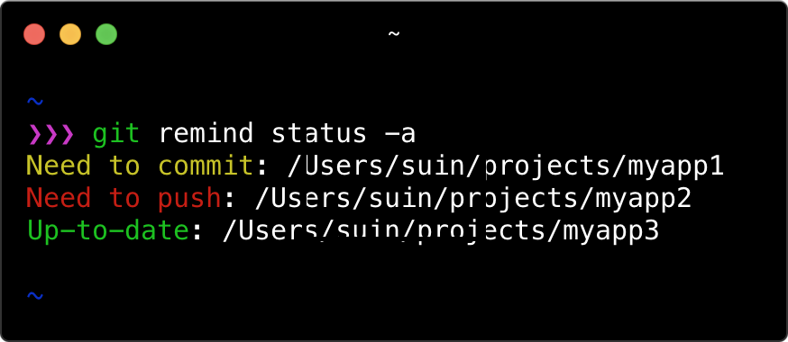
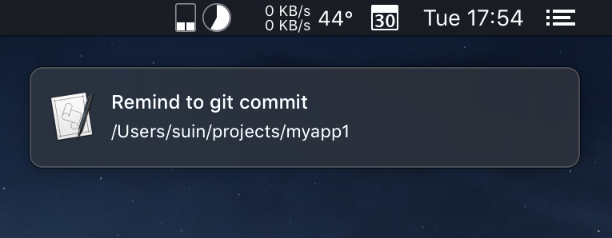
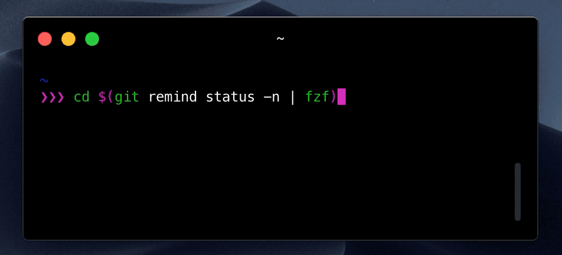

# git-remind

git-remind is a command line tool that prevent you to forget git-commit and git-push.

## Features

### git-commit/git-push status

git-remind checks across the all git repositories in your computer, and it displays the status whether there are uncommitted files and there are ahead commits which should be pushed to remote.



### Desktop Notification

git-remind notifies you git-commit/git-push status using desktop notification. This feature is tested macOS, but it will work in Windows and Linux.



## Installation

### Homebrew

```
brew install suin/suin/git-remind
```

### Manually

Download build binary from the [releases](https://github.com/suin/git-remind/releases).

## Configuration

Add `remind.paths` to your `.gitconfig`, using your own absolute path to the repository directories. 

```text:.gitconfig
[remind]
	paths = /Users/you/projects/foo,/Users/you/projects/bar
```

If you have some git repositories (e.g. `~/projects/foo` and `~/projects/bar`) in the same directory (e.g. in `~/projects`) , you may specify the path using wildcard (e.g.`/Users/you/projects/*`):


```text:.gitconfig
[remind]
	paths = /Users/you/projects/*
```

You can also utilise the `git config` command to configure git-remind to avoid the manually editing of the `.gitconfig`.

```bash
git config --global remind.paths '/Users/you/projects/*'
```

Check the configuration using following command:

```bash
git-remind paths # Shows path patterns configuration
git-remind repos # Shows git repositories to be reminded
```

## Usage

### Display git-commit/git-push status

```
$ git-remind status
Need to commit: /Users/suin/projects/myapp1
Need to commit and push: /Users/suin/projects/myapp2
```

#### Short status like `git status -s`

```
$ git-remind status -s
C  /Users/suin/projects/myapp1
CP /Users/suin/projects/myapp2
```

#### Show all status including up-to-date repositories 

```
$ git-remind status -a
Need to commit: /Users/suin/projects/myapp1
Need to commit and push: /Users/suin/projects/myapp2
Up-to-date: /Users/suin/projects/myapp3
```

### Desktop Notification

```
git-remind status-notification
```

### Ad-hoc paths configuration

The paths can be specified with `--path` option instead of git global configuration `remind.paths`.

```
$ git-remind --path '/path/to/dir/*' paths
/path/to/dir/*
```

The option accepts multiple paths giving two or more `--path` options.

```
$ git-remind --path '/path/to/dir1/*' --path '/path/to/dir2/*' paths
/path/to/dir1/*
/path/to/dir2/*
```

Also giving the environment variable `GIT_REMIND_PATHS`, it makes the same effect.

```
$ export GIT_REMIND_PATHS='/path/to/dir1/*,/path/to/dir2/*'
$ git-remind paths
/path/to/dir1/*
/path/to/dir2/*
```

When both of `--path` option and `GIT_REMIND_PATHS` are given, the paths become the combination of the both.

```
$ export GIT_REMIND_PATHS='/path/to/dir1/*,/path/to/dir2/*'
$ git-remind --path '/path/to/dir3/*' paths
/path/to/dir1/*
/path/to/dir2/*
/path/to/dir3/*
```

## Advanced usage

### Scheduled reminder (cron)

To get scheduled reminder, set up crontab. Following example send notifications every 20 minutes:

```
PATH=/usr/local/bin:/usr/bin:/bin

*/20 * * * * git-remind status-notification > /dev/null 2>&1
```

### Jumping to the repositories

By combining git-remind and [fzf](https://github.com/junegunn/fzf), you will be able to jump the repositories that needs to commit or push:

```
cd $(git remind status -n | fzf)
```



It would be useful that you set command alias in your .bashrc/.zshrc:

```bash
alias grj='cd $(git remind status -n | fzf)'
```
